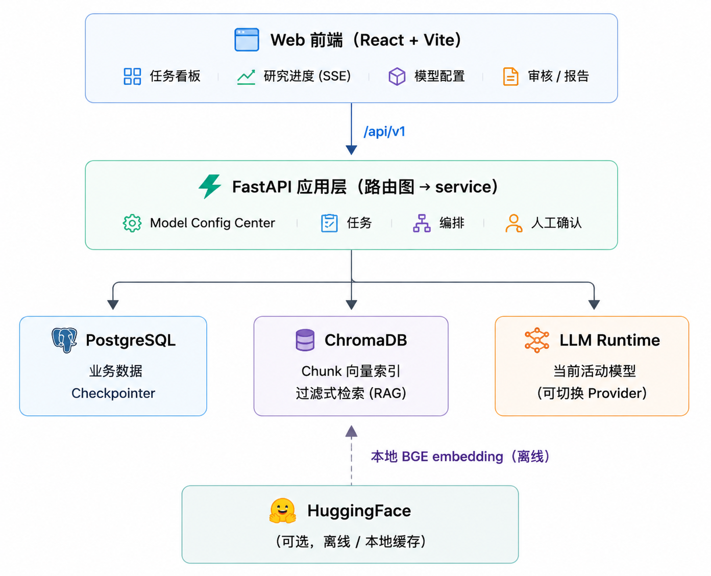

# InsightForge

面向 A 股上市公司的**证据驱动基本面研究与事实审核**系统。结论可追溯、数字可复核：
**Source → Evidence → Claim → Report → Audit** 全链路可审计，一切财务数字可由原始观测确定性重算。

Insight 生成与「人工确认」闭环：AI 规划 → 采集官方披露/新闻 → 关键证据提取 → 财务/宏观/估值分析 →
生成报告 → **事实审核（Audit）** → 人工批准后定稿。强调证据来源、追踪与可复现性，
不做自动交易、技术分析、短期预测或买卖建议。

## Features

- **证据驱动研究链**：官方披露（公告 / 官网 IR / 财报）+ 新闻（GDELT）多源采集，全部来源可回溯。
- **LangGraph 顶层编排**：规划 → 采集 → RAG 证据提取 → 结构化分析 → 报告 → 审计 → 人工确认，
  断点可中断/恢复，支持审核回退与受控修订。
- **可复核分析**：财务指标由原始观测**确定性重算**，Macro 宏观驱动带来源与捕获时点传递，
  相对估值基于可比公司对比，杜绝 AI 编造数字。
- **事实审核（Audit）**：生成报告前对内容/理由做一致性核验，未通过则回退修订，人工确认才定稿。
- **本地优先 embedding**：BGE 模型本地加载（离线可用），ChromaDB 做过滤式向量检索。
- **模型配置中心**：在 Web 界面配置 LLM Provider（DeepSeek 或任意 OpenAI 兼容 API），
  运行时按当前活动模型推理，API Key 加密存储。
- **用户任务看板与 SSE 实时进度**：创建任务、跟踪研究进展、人工确认 / 补资料 / 重试。

## Quick Start

普通用户只需要 **Docker** — 不需要 conda / python / npm / pytest。

### 1. 克隆

```bash
git clone https://github.com/<your-org>/InsightForge.git
cd InsightForge
```

### 2. 配置 .env

```bash
cp .env.example .env
```

`.env` 负责**基础运行环境与基础设施配置**（数据库连接、端口、存储路径等），按需编辑：

- 数据库密码（可选，默认 `change_me`）；
- 基础运行环境配置（端口 / 存储路径 / 代理等）。

> **用户无需在 `.env` 中配置 LLM。** 模型与 API Key 一律在 Web 的 **Model Configuration**中进行配置

### 3. 一键启动

```bash
docker compose up --build
```

启动完成后：

| 服务 | 地址 |
| --- | --- |
| Web 前端 | http://localhost:8080 |
| API 文档 | http://localhost:8001/docs |

首次启动自动迁移数据库 schema 并导入内置数据（来源机构注册表 / 5500+ 家 A 股公司主数据 / 官网域名 registry），
无需手动 seed。

### 停止

```bash
docker compose down
```

## 用户第一次使用流程

首次启动后按以下步骤开始研究：

Docker 启动 → 打开 Web → 进入 Model Configuration → 添加模型 → 测试连接 → 设为当前模型 → 开始研究

1. **Docker 启动**：`docker compose up --build`（见上方 Quick Start）。
2. **打开 Web**：浏览器访问 **http://localhost:8080**。
3. **进入 Model Configuration**（模型配置中心）。
4. **添加模型**：填写

   - **Provider**（如 `deepseek`，或任意 OpenAI 兼容服务名）；
   - **Model ID**（模型标识，如 `deepseek-v4-flash`）；
   - **Base URL**（API 端点；DeepSeek 官方无需改，自定义网关需填）；
   - **API Key**。

5. **测试连接**：保存前先点击 **测试连接**，系统会用该配置发起一次真实推理请求，确认连通与 Key 有效。
6. **设为当前模型（active）**：研究与报告全流程即自动使用该模型。
7. **开始研究**：回到首页点击 **新建研究任务**，输入公司名（如 `贵州茅台` 或 `600519`）。
8. 系统自动执行：研究规划 → 资料采集 → 证据提取 → 分析 → 报告 → **Audit 审核**。
   资料不足或等待审批时停在人工环节，按界面提示 **approve / 补资料** 后继续。

### 模型配置中心支持

**模型配置中心支持：**

- **DeepSeek**：内置官方 Provider，开箱即用；
- **OpenAI-compatible provider**：任意兼容 OpenAI Chat Completions 的第三方服务；
- **自定义 Base URL**：可指向前置网关 / 代理 / 私有部署端点。

配置保存后，**API Key 会被加密安全保存在应用内，界面只显示「已配置」，绝不展示明文**。
模型的 Provider、Model、Base URL 变更与新增 / 删除都在该页面完成，无需改代码或 `.env`。

## Architecture


- **Backend**：FastAPI + LangGraph（唯一顶层编排器）。确定性任务（解析、切分、重算、采集）交给代码，
  判断与综合交给 Agent。
- **PostgreSQL**：业务数据 + LangGraph Checkpointer（中断/恢复/回放）。
- **ChromaDB**：文档 Chunk 向量索引；BGE 模型**本地加载**，离线可用。
- **外部源**：官方披露（公告 / 官网 IR / 财报）+ 新闻（GDELT）+ Macro（World Bank 等），全部来源可回溯。
- **模型无关**：通过模型配置中心选择 Provider，运行时按 active 模型推理（DeepSeek 或任意 OpenAI 兼容 API）。
- 详细设计见 `docs/`（ADR 与验收记录）。

## Development Setup

面向**开发者**：本地起依赖服务 + 后端 + 前端，可跑测试与 lint。

### 前置要求

- Docker（提供 PostgreSQL 与 ChromaDB）
- Python 3.12（建议 conda 环境，如 `insightforge`）
- Node.js 18+

### 1. 依赖服务

```bash
docker compose up -d postgres chroma
```

### 2. 后端

```bash
cp .env.example .env        # 按需修改数据库密码；LLM 模型/Key 请在 Web Model Configuration 配置
cd backend
# 首次安装（CPU-only torch 走 PyTorch CPU index）
pip install -e ".[dev]" --extra-index-url https://download.pytorch.org/whl/cpu
python -m alembic upgrade head      # 空库时初始化 schema
python -m app.cli.run_backend       # 启动 API（默认 http://127.0.0.1:8001）
```

### 3. 前端

```bash
cd frontend
npm ci
npm run dev                 # http://localhost:5173（API 默认指向 8001）
```

### 4. 测试与质量

```bash
cd backend
python -m pytest                    # 单元测试
python -m pytest -m integration     # 集成测试（需 PostgreSQL + Chroma 已启动）
python -m ruff check app tests      # lint

cd ../frontend
npm run test
npm run typecheck
npm run build
```

### 备注

- Windows 下外部网络走代理时，启动后端前设置 `$env:NO_PROXY='*'` 可避免代理干扰；
  `run_backend` 已处理 Windows 事件循环问题。
- HuggingFace 不可达时，可用 `EMBEDDING_LOCAL_MODEL_PATH=<本地模型目录>` 让 embedding 走本地离线加载。
- 内部开发 / 验收脚本位于 `scripts/dev/` 与 `scripts/internal/`，普通使用无需关心。
